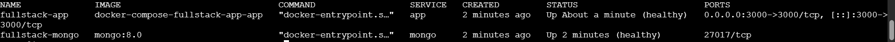
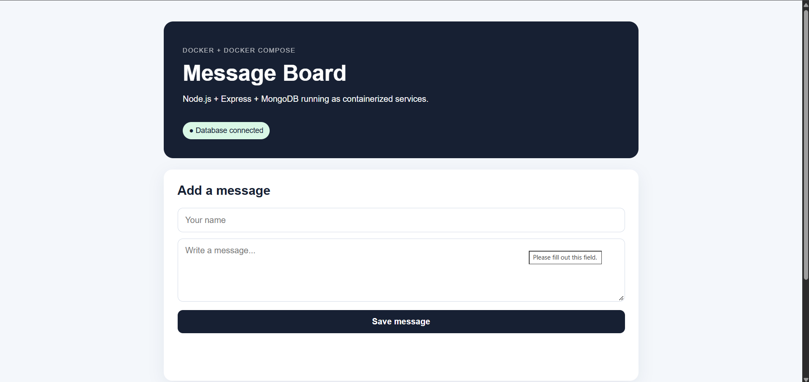
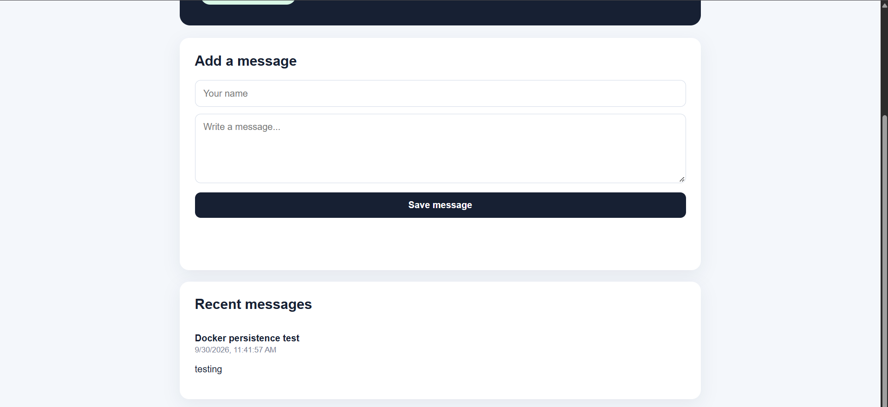

# Docker Compose Full-Stack Message Board

A simple full-stack Message Board application containerized using **Docker** and **Docker Compose**.

This project demonstrates how to containerize a Node.js/Express application, connect it to MongoDB using Docker Compose, manage configuration through environment variables, use health checks, and persist database data using a Docker volume.

---

## 🚀 Project Overview

The application consists of two services:

- **Application:** Node.js + Express
- **Database:** MongoDB 8

Docker Compose is used to run and manage both services together.

### Technologies Used

- Node.js
- Express.js
- MongoDB
- HTML
- CSS
- JavaScript
- Docker
- Docker Compose

---

## 🏗️ Architecture

```text
                         Browser
                            |
                            | HTTP :3000
                            v
                  +----------------------+
                  |    fullstack-app     |
                  |   Node.js + Express  |
                  |      Port 3000       |
                  +----------+-----------+
                             |
                             | MongoDB
                             | Docker Network
                             v
                  +----------------------+
                  |    fullstack-mongo   |
                  |      MongoDB 8       |
                  |      Port 27017      |
                  +----------+-----------+
                             |
                             v
                  +----------------------+
                  | fullstack-mongo-data |
                  |    Docker Volume     |
                  +----------------------+
```

### Request Flow

1. The user opens the application in a browser.
2. The browser sends requests to the Node.js/Express application.
3. The application runs inside the `fullstack-app` container.
4. The application communicates with MongoDB using the Docker Compose service name `mongo`.
5. MongoDB stores application data in the persistent `fullstack-mongo-data` volume.

---

## 📁 Project Structure

```text
docker-compose-fullstack-app/
│
├── public/
│   ├── app.js
│   ├── index.html
│   └── styles.css
│
├── screenshots/
│   ├── browser-docker.png
│   ├── docker-compose.png
│   ├── docker-ps.png
│   └── docker-persistence.png
│
├── src/
│   └── server.js
│
├── .dockerignore
├── .env.example
├── .gitignore
├── ARCHITECTURE.md
├── docker-compose.yml
├── Dockerfile
├── package.json
├── package-lock.json
└── README.md
```

> `.env` is intentionally not included in the repository because it contains local configuration and credentials.

---

## 📋 Prerequisites

Before running the project, make sure the following are installed:

- Docker
- Docker Compose
- Git

Check the installed versions:

```bash
docker --version
docker compose version
git --version
```

---

## ⚙️ Environment Variables

The project uses environment variables through a `.env` file.

Create the `.env` file from the provided example:

```bash
cp .env.example .env
```

Open `.env` and configure the values:

```env
APP_PORT=3000
NODE_ENV=production
MONGO_DB=messageboard
MONGO_ROOT_USERNAME=admin
MONGO_ROOT_PASSWORD=your_secure_password_here
```

Replace:

```text
your_secure_password_here
```

with a strong password.

### Important

Do **not** commit `.env` to GitHub.

The `.env` file is excluded through `.gitignore`.

The repository only contains `.env.example` with placeholder values.

---

## 🐳 Dockerfile

The application uses a lightweight Node.js Alpine image.

Important Docker practices used in the Dockerfile include:

- Lightweight `node:22-alpine` base image
- `npm ci --omit=dev` for reproducible production installations
- Separate dependency installation layer
- Non-root `node` user
- Application health check
- Direct Node.js startup command

The application is started using:

```dockerfile
CMD ["node", "src/server.js"]
```

Running the application directly with Node.js allows the application to properly receive termination signals and perform graceful shutdown.

---

## 🔧 Docker Compose

Docker Compose manages both application services:

```text
fullstack-app
fullstack-mongo
```

The Compose configuration provides:

- Application container
- MongoDB container
- Environment variables
- Dedicated Docker network
- MongoDB authentication
- Health checks
- Service dependency management
- Persistent MongoDB volume
- Restart policies

---

## 🌐 Docker Networking

Docker Compose creates a dedicated network for the services.

The application communicates with MongoDB using the service name:

```text
mongo
```

MongoDB listens internally on:

```text
27017
```

The application connects to MongoDB using:

```text
mongodb://<username>:<password>@mongo:27017/messageboard?authSource=admin
```

MongoDB does **not** need to expose port `27017` to the host.

Only the application port is exposed:

```text
3000:3000
```

This keeps the database accessible only to services inside the Docker network.

---

# 🚀 Running the Application

## 1. Create the Environment File

From the project directory:

```bash
cp .env.example .env
```

Edit the `.env` file and set your MongoDB password.

---

## 2. Build and Start the Containers

Run:

```bash
docker compose up --build
```

This command:

1. Builds the application Docker image.
2. Creates the Docker network.
3. Creates the MongoDB volume if required.
4. Starts MongoDB.
5. Waits for MongoDB to become healthy.
6. Starts the application container.

---

## 3. Run in Detached Mode

To run the application in the background:

```bash
docker compose up --build -d
```

---

## 4. Check Running Containers

Run:

```bash
docker compose ps
```

You can also use:

```bash
docker ps
```

You should see the following services:

```text
fullstack-app
fullstack-mongo
```

MongoDB should show a healthy status.

---

## 5. Open the Application

Open your browser and visit:

```text
http://localhost:3000
```

If running the application on an EC2 instance, use:

```text
http://YOUR_EC2_PUBLIC_IP:3000
```

Make sure the EC2 security group allows inbound TCP traffic on port `3000` if you need browser access from the internet.

---

## ❤️ Health Check

The application provides a health endpoint:

```text
http://localhost:3000/health
```

You can also test it using:

```bash
curl http://localhost:3000/health
```

A successful response indicates that the application is running.

---

# 📊 Checking Container Health

Run:

```bash
docker compose ps
```

The application and MongoDB containers should be running.

You can inspect the application logs using:

```bash
docker compose logs app
```

Follow the logs continuously:

```bash
docker compose logs -f app
```

MongoDB logs:

```bash
docker compose logs mongo
```

Follow MongoDB logs:

```bash
docker compose logs -f mongo
```

View logs from all services:

```bash
docker compose logs -f
```

---

# 💾 Persistent Database Storage

MongoDB uses a named Docker volume:

```text
fullstack-mongo-data
```

The volume is mounted inside the MongoDB container at:

```text
/data/db
```

This allows MongoDB data to survive container recreation.

For example:

```bash
docker compose down
```

Then start the application again:

```bash
docker compose up -d
```

The MongoDB data remains available because the named volume is not removed by a normal `docker compose down`.

---

## 🧪 Testing Persistence

To verify persistence:

### Step 1

Open the application:

```text
http://localhost:3000
```

Add a message.

### Step 2

Stop and remove the containers:

```bash
docker compose down
```

### Step 3

Start the application again:

```bash
docker compose up -d
```

### Step 4

Refresh the browser.

The previously created message should still be available.

This demonstrates that MongoDB data is stored in the persistent Docker volume.

---

## ⚠️ Removing the Database Volume

The following command removes the containers **and** the database volume:

```bash
docker compose down -v
```

This will delete the MongoDB data stored in the volume.

> Use `docker compose down -v` only when you intentionally want to remove the database data.

---

# 🛑 Stopping the Application

To stop the containers without removing them:

```bash
docker compose stop
```

To stop and remove the containers and Docker network:

```bash
docker compose down
```

To stop and remove containers, network, and database volume:

```bash
docker compose down -v
```

---

# 🔄 Rebuilding the Application

If you make changes to the source code or Docker configuration, rebuild the application:

```bash
docker compose up --build -d
```

To rebuild without using the Docker cache:

```bash
docker compose build --no-cache
```

Then start the services:

```bash
docker compose up -d
```

---

# 🔐 Security Practices

The project follows several basic container security practices.

### Non-root Application

The Node.js application runs using the non-root `node` user instead of running as root.

### MongoDB Authentication

MongoDB uses username and password authentication configured through environment variables.

### Private MongoDB Port

MongoDB port `27017` is not published to the host.

The application communicates with MongoDB through the private Docker network.

### Environment Variables

Sensitive configuration such as the MongoDB password is stored in `.env`.

The `.env` file is excluded from Git using `.gitignore`.

### Example Configuration

The repository contains:

```text
.env.example
```

instead of the actual `.env` file.

---

# 🩺 Health Checks

Both services use health checks.

MongoDB health checks verify that the database is ready to accept connections.

The application health check verifies that the Node.js application is responding correctly.

The application depends on MongoDB being healthy before starting.

This is configured through Docker Compose using:

```text
depends_on
```

with a health condition.

This helps prevent the application from attempting to connect to a database that is not ready yet.

---

# 🔄 Graceful Shutdown

The Node.js application includes graceful shutdown handling.

When the container receives a termination signal, the application closes the MongoDB connection and shuts down cleanly.

The Dockerfile starts the application directly using:

```dockerfile
CMD ["node", "src/server.js"]
```

This allows the Node.js process to properly receive Docker termination signals.

---

# 📦 Docker Best Practices Used

This project follows several Docker best practices:

- Uses a lightweight Alpine-based Node.js image.
- Uses `npm ci --omit=dev` for reproducible production dependencies.
- Includes `package-lock.json`.
- Uses a `.dockerignore` file.
- Excludes `.git`, screenshots, documentation, and unnecessary files from the Docker build context.
- Runs the application as a non-root user.
- Uses environment variables for configuration.
- Keeps sensitive `.env` files out of Git.
- Uses a dedicated Docker network.
- Uses health checks.
- Uses `depends_on` with health conditions.
- Uses a persistent named volume for MongoDB.
- Does not expose MongoDB's port to the host.
- Uses graceful shutdown handling.
- Uses Docker Compose for multi-container management.

---

# 🧩 Container Responsibilities

## Application Container

Container name:

```text
fullstack-app
```

Responsibilities:

- Runs Node.js.
- Runs the Express server.
- Serves the frontend.
- Provides application APIs.
- Connects to MongoDB.
- Listens on port `3000`.

---

## MongoDB Container

Container name:

```text
fullstack-mongo
```

Responsibilities:

- Runs MongoDB 8.
- Stores application data.
- Provides the database service.
- Uses authentication.
- Stores database files in the persistent Docker volume.
- Provides a health check.

---

# 🔗 Container Communication

The containers communicate through the Docker Compose network.

The application does not connect to:

```text
localhost:27017
```

Instead, it connects to the MongoDB service using:

```text
mongo:27017
```

The Docker Compose service name `mongo` works as the hostname inside the Docker network.

The communication flow is:

```text
Browser
   |
   | :3000
   v
Node.js / Express
   |
   | mongo:27017
   v
MongoDB
   |
   v
Persistent Docker Volume
```

---

# 🤔 Why Docker Compose?

Docker Compose makes it easier to manage multiple containers that work together.

Without Docker Compose, the application and MongoDB containers would need to be created and configured separately.

With Docker Compose, the complete application can be started using:

```bash
docker compose up --build
```

Docker Compose automatically manages:

- Containers
- Networking
- Environment variables
- Volumes
- Health checks
- Service dependencies
- Container startup and shutdown

This makes the application easier to develop, test, and deploy consistently.

---

# 📸 Screenshots

## Docker Compose Startup

Shows the successful Docker Compose build and startup.


---

## Running Containers

Shows the application and MongoDB containers running successfully.



---

## Application in Browser

Shows the Message Board application running successfully in the browser.



---

## Database Persistence

Shows a message remaining available after stopping and starting the containers again.



---

# 🛠️ Useful Docker Commands

### Start services

```bash
docker compose up
```

### Build and start

```bash
docker compose up --build
```

### Start in background

```bash
docker compose up -d
```

### Build and start in background

```bash
docker compose up --build -d
```

### Check services

```bash
docker compose ps
```

### Check all containers

```bash
docker ps
```

### View logs

```bash
docker compose logs
```

### Follow logs

```bash
docker compose logs -f
```

### Application logs

```bash
docker compose logs -f app
```

### MongoDB logs

```bash
docker compose logs -f mongo
```

### Stop services

```bash
docker compose stop
```

### Remove containers and network

```bash
docker compose down
```

### Remove containers, network, and volume

```bash
docker compose down -v
```

### Rebuild without cache

```bash
docker compose build --no-cache
```

---

# 🎯 Project Objectives

The main objectives of this project are:

1. Containerize a full-stack application.
2. Run the application using Docker.
3. Run MongoDB in a separate container.
4. Connect multiple containers using Docker Compose.
5. Configure services using environment variables.
6. Use health checks for service readiness.
7. Persist MongoDB data using a Docker volume.
8. Follow Docker security and best practices.
9. Manage the complete application using a single Compose configuration.

---

# ✅ Features Demonstrated

- Full-stack application containerization
- Node.js and Express
- MongoDB
- Docker
- Docker Compose
- Docker networking
- Environment variables
- MongoDB authentication
- Persistent volumes
- Health checks
- Service dependencies
- Non-root container execution
- Graceful shutdown
- Reproducible dependency installation
- Production-oriented container configuration

---

# 📚 Learning Outcomes

Through this project, the following concepts are demonstrated:

- Creating Docker images
- Writing a Dockerfile
- Building containers
- Running containers
- Creating Docker networks
- Connecting containers
- Using Docker Compose
- Managing environment variables
- Using Docker volumes
- Implementing health checks
- Understanding container dependencies
- Running containers securely as a non-root user
- Managing multi-container applications

---

# 🏁 Conclusion

This project demonstrates how a simple full-stack application can be containerized and managed using Docker and Docker Compose.

The Node.js/Express application and MongoDB database run as separate services while communicating through a private Docker network.

MongoDB data is stored in a persistent named volume, allowing application data to survive container recreation.

The project also demonstrates important Docker practices including health checks, environment-based configuration, non-root execution, reproducible dependency installation, private database networking, `.dockerignore`, and graceful application shutdown.

The complete application stack can be started with a single command:

```bash
docker compose up --build
```

---

## 👨‍💻 Author

**krishnakanthula Shivamani**

GitHub: https://github.com/shivamani3286-cloud

LinkedIn: https://www.linkedin.com/in/krishnakanthula-shivamani
