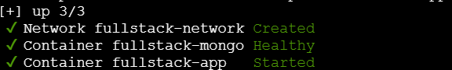
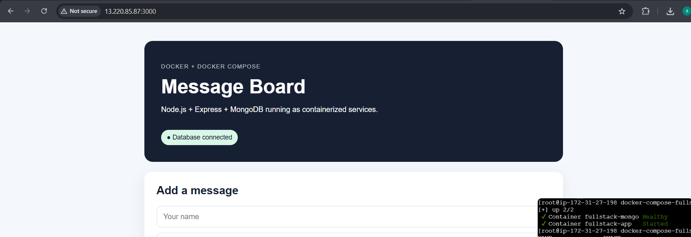
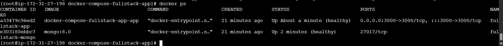

# Docker Compose Full-Stack Message Board

A simple full-stack application containerized with **Docker** and **Docker Compose**.

- **Frontend:** HTML, CSS and JavaScript served by Express
- **Backend:** Node.js + Express
- **Database:** MongoDB
- **Orchestration:** Docker Compose
- **Persistence:** Named Docker volume for MongoDB

## Project Architecture

```text
                    Browser
                       |
                       | http://localhost:3000
                       v
              +-------------------+
              |   fullstack-app   |
              | Node.js + Express |
              |  Port 3000        |
              +---------+---------+
                        |
                        | mongodb://<username>:<password>@mongo:27017/messageboard?authSource=admin
                        v
              +-------------------+
              |  fullstack-mongo  |
              |    MongoDB 8      |
              +---------+---------+
                        |
                        v
                fullstack-mongo-data
                   Docker volume
```

The browser communicates with the Express application. The Express container communicates with MongoDB over the private Docker Compose network using the service name `mongo`. MongoDB data is stored in the named volume `fullstack-mongo-data`, so removing/recreating containers does not remove the database data.

## Prerequisites

Install:

1. Docker Desktop (Windows/macOS) or Docker Engine + Docker Compose plugin (Linux)
2. Git  

Verify:

```bash
docker --version
docker compose version
git --version
```

## Folder Structure

```text
docker-compose-fullstack-app/
├── public/
│   ├── app.js
│   ├── index.html
│   └── styles.css
├── screenshots/
│   ├── browser-docker.png
│   ├── docker-compose.png
│   └── docker-ps.png
├── src/
│   └── server.js
├── .dockerignore
├── .env.example
├── .gitignore
├── ARCHITECTURE.md
├── docker-compose.yml
├── Dockerfile
├── package.json
├── package-lock.json
└── README.md
```

## Environment Variables

The application uses environment variables through a `.env` file.

Create the `.env` file from the provided example:

```bash
cp .env.example .env
```

Edit the `.env` file and set a strong MongoDB password before starting the application.

```env
APP_PORT=3000
NODE_ENV=production
MONGO_DB=messageboard
MONGO_ROOT_USERNAME=admin
MONGO_ROOT_PASSWORD=your_secure_password_here
```

Do **not** commit `.env` to GitHub. It is excluded through `.gitignore`.

## Run the Application

From the project root, create the environment file:

```bash
cp .env.example .env
```
<p align="center">
  
</p>

This single command builds the Node.js image and starts both services.

Run in detached mode:

```bash
docker compose up --build -d
```

Open:

```text
http://localhost:3000
```
<p align="center">
  
</p>

Health endpoint:

```text
http://localhost:3000/health
```

## Verify Containers

```bash
docker ps
```
<p align="center">
  
</p>

You should see:

- `fullstack-app`
- `fullstack-mongo`

Check service logs:

```bash
docker compose logs -f
```

Check only the application:

```bash
docker compose logs -f app
```

Check MongoDB:

```bash
docker compose logs -f mongo
```

## Stop the Application

Stop containers without deleting them:

```bash
docker compose stop
```

Stop and remove containers/network:

```bash
docker compose down
```

Remove containers and the persistent database volume too:

```bash
docker compose down -v
```

> `docker compose down -v` permanently removes the MongoDB data stored in the Compose volume.

## Docker Best Practices Used

- Small `node:22-alpine` base image.
- Dependencies are installed before application source to improve layer caching.
- Production dependency installation with `npm ci --omit=dev` for reproducible builds.
- Application runs as the non-root `node` user.
- MongoDB data uses a named persistent volume.
- Services communicate through a dedicated Docker network.
- `depends_on` waits for MongoDB health before starting the application.
- Health checks are configured for both the application and database.
- Configuration is supplied through environment variables.
- `.env` is excluded from Git.
- Containers use meaningful names and restart policies.

## Screenshots

Capture the required screenshots after running the project locally:

1. Successful `docker compose up --build`
2. `docker ps` showing both containers
3. Browser showing `http://localhost:3000`

Place the screenshots inside `screenshots/` before pushing to GitHub.

## GitHub

Create a repository named:

```text
docker-compose-fullstack-app
```

Then:

```bash
git init
git add .
git commit ...
git branch -M main
git remote add origin ...
```
